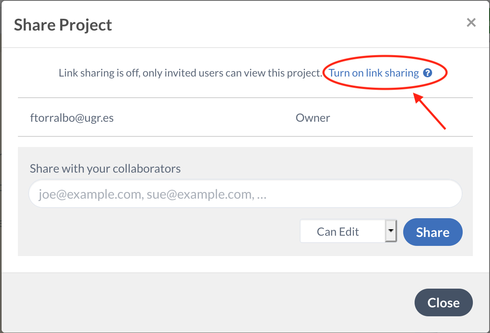

# Curso: Introducción al lenguaje LaTeX para edición de textos académicos

Esta carpeta contiene el material para el curso [*Introducción al lenguaje LaTeX para edición de textos académicos*](https://sites.google.com/go.ugr.es/yosigopublicando/los-cursos#h.1rvelu5hbhsq) que se va a impartir a través de la plataforma [**yosigopublicando**](https://sites.google.com/go.ugr.es/yosigopublicando/principal) de la [Universidad de Granada](https://www.ugr.es/).

## Objetivos del curso

Guiar a los asistentes en el uso del programa de edición de textos científicos LaTeX. Enseñar y practicar con el paquete Beamer de LaTeX para la edición de presentaciones. Proporcionar otras herramientas útiles para exportar datos y gráficos a código LaTeX a través de la utilización de otro software matemático como Maxima, GnuPlot, Octave, etc, que les permita editar y presentar trabajos con contenido científico-técnico (trabajos fin de grado o de master, libros, artículos…). 

El curso está dividido en 4 sesiones:
- **Sesión 1** (Francisco Torralbo): Introducción. Primeros pasos (cabecera: babel, inpuntenc, fontenc...; estructura de un documento básico: secciones; comandos y entornos; listas; preparar plantillas básicas para: artículo, libro, transparencias; Plantilla para TFM/TFG). Bibliografía e hipervínculos (jabref; hyperref; backref). Resolución de problemas de instalación...
- **Sesión 2** (Jerónimo Alaminos): Edición de matemáticas. Escribir fórmulas matemáticas en LaTeX $ $; \[ \]; tablas; figuras; matrices; etiquetas y referencias (showkeys); errores en la compilación.
- **Sesión 3** (Pedro García): Presentaciones. Presentaciones usando markdown. Presentaciones con LaTeX usando beamer.
- **Sesión 4** (Óscar Sánchez): Gráficos. Inclusión de archivos gráficos externos en documentos de LaTeX (includegraphics; el paquete graphicx; mejorando la presentación con el paquete wrapfig). Generación de figuras nativas en documentos LaTeX (generación de código Pstrics/Tikz mediante un programa auxiliar: GeoGebra, gnuplot,...; generando nuestro propio código Tikz: inclusión de datos numéricos; el paquete PGFPlots).

## Material para el curso

Previo a cada sesión, deberemos [descargar el contenido](https://github.com/latex-mat-ugr/curso-virtual-2021/archive/main.zip) de este repositorio y subir a overleaf la carpeta correspondiente a dicha sesión. 

Para subir el material a overleaf seguiremos los siguientes pasos:

1. Crear un proyecto nuevo: **Nuevo proyecto** > **Subir proyecto**
2. Arrastrar el archivo comprimido que hemos descargado.
3. Abrir el archivo `mi primer documento.tex`

Las siguientes capturas nos muestran el proceso:

[Arrastrar el archivo comprimido](Sesión 1/Presentación/img/overleaf-arrastrar-zip.png?raw=true)

## Seguimiento del curso a través de Overleaf

Se recomienda seguir las sesiones usando el editor online Overleaf. Es posible, no obstante, usar una instalación local de LaTeX mediante el paquete proTeXt (material e instrucciones están disponibles en [Curso Latex](README.md)). Los asistentes deberán en la primera sesión tener acceso a alguna de las distribuciones anteriores.

## Resolución de dudas durante las sesiones

Debido al carácter online del curso y la cantidad de participantes habrá conectados durante cada sesión varios *tutores* (identificados como tal en el chat de Zoom). Para resolver una duda se procederá de la siguiente forma:

1. Localizar en chat algún tutor con el icono de *mano levantada* (eso quiere decir que está disponible)
2. Abrir un chat privado con el tutor.
3. Preguntar la duda a través de dicho chat privado. Si el tutor lo cree necesario *compartir* el proyecto en overleaf con él para que pueda detectar más fácilmente el error. Para compartir un proyecto en overleaf usaremos el botón **Share** en la parte superior derecha del editor:

A continuación aparecerá una pantalla con dos tipos de enlaces:

y copiaremos el primero para compartirlo en el chat del tutor.

Si no aparece directamente esa ventana tendremos que pulsar en el enlace *Turn on link sharing*:

